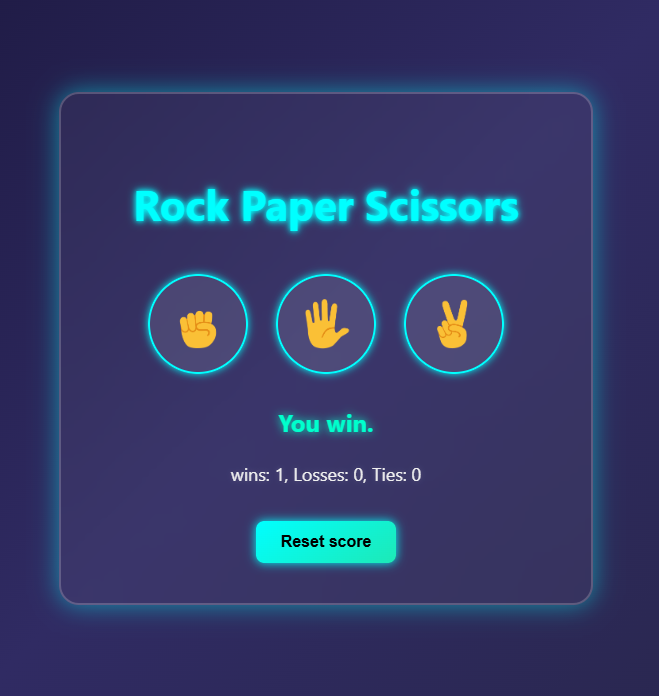
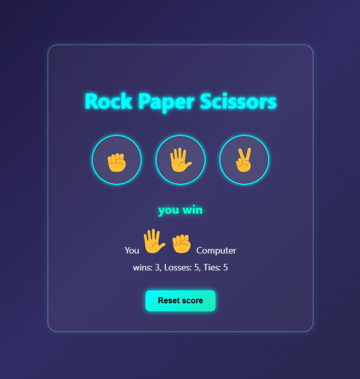
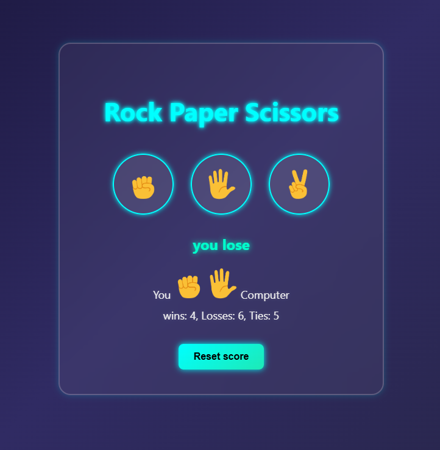
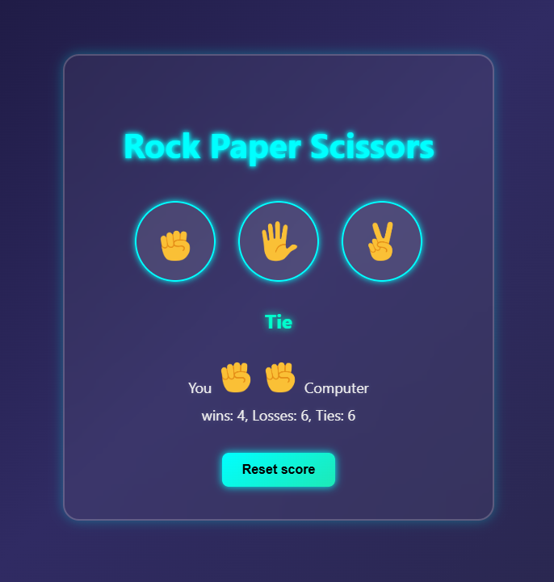
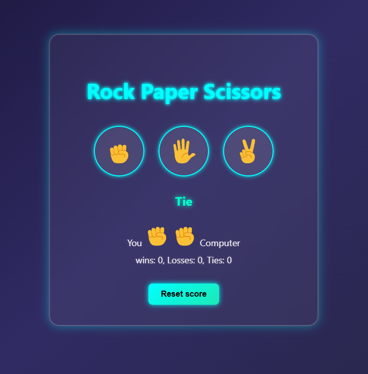

# ✊🖐✌️ Rock Paper Scissors Game

A modern, interactive **Rock Paper Scissors** game built using **HTML, CSS, and JavaScript**, featuring a beautiful glowing neon UI and smooth gameplay logic.

  
  
    
  
  

---

## 🎮 Features

- ✨ **Modern Neon UI** with glowing effects
- ⚡ Smooth and responsive game interaction
- 🧠 Simple AI generates random moves for the computer
- 📊 Live win/loss/tie score tracking
- 🔄 Reset button to start a new game anytime

---

## 🛠️ Technologies Used

- HTML5
- CSS3 (with modern styling & hover effects)
- Vanilla JavaScript (no libraries)

---
